# 🫀 Patient-Specific Bladder Digital Twin — Two-Way FSI Simulation

<p align="center">
  
  
  
  
  
</p>

<p align="center">
  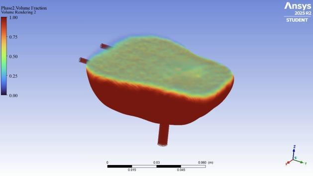
</p>

<p align="center">
  <b>A patient-specific computational model of bladder filling (100–700 mL) using two-way Fluid-Structure Interaction (FSI) simulation built on real MRI-derived geometry.</b>
</p>

---

## 📌 Table of Contents

- [Overview](#overview)
- [FSI Simulation Animation](#-fsi-simulation-animation)
- [Key Concepts](#-key-concepts)
- [Background & Motivation](#-background--motivation)
- [Objectives](#-objectives)
- [Workflow](#-workflow)
- [Material Properties](#-material-properties)
- [Simulation Setup](#-simulation-setup)
- [Results](#-results)
- [Conclusion & Future Work](#-conclusion--future-work)
- [References](#-references)

---

## 🔬 Overview

This project constructs a **patient-specific digital twin of the human urinary bladder** to simulate the mechanical behaviour of bladder wall and urine fluid dynamics during the filling phase (100 mL → 700 mL). The simulation uses **two-way Fluid-Structure Interaction (FSI)**, bidirectionally coupling ANSYS Fluent (fluid) and ANSYS Transient Structural (solid), enabling realistic prediction of wall deformation, stress distribution, and fluid volume fraction evolution — all without invasive clinical procedures.

---

## 🎬 FSI Simulation Animation

<p align="center">
  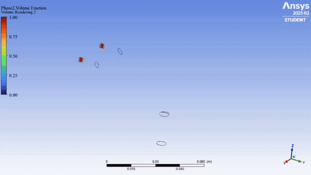
</p>

<p align="center">
  <i>Two-way FSI simulation of bladder filling from 100 mL to 700 mL — fluid volume fraction and wall deformation coupled in real time via ANSYS System Coupling</i>
</p>

---

## 🧠 Key Concepts

### Digital Twin

A **Digital Twin** is a dynamic virtual model of an individual patient that integrates clinical, molecular, imaging, and environmental data in real time. It simulates, monitors, and predicts health status and treatment responses.

<p align="center">
  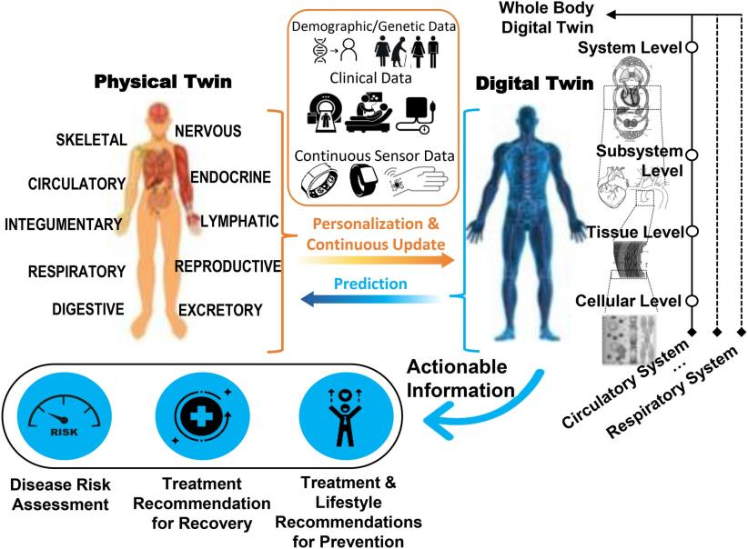
</p>

**Three core components:**
1. **Physical Patient** — real-world biological entity
2. **Computing (Virtual) Replica** — high-fidelity computational model
3. **Bidirectional Real-Time Data Link** — continuous feedback loop

> **Goal:** Enable personalised predictive medicine.

---

### Two-Way FSI (Fluid-Structure Interaction)

In a **two-way FSI** framework:
- Fluid pressure and flow **deform the structure** (bladder wall)
- The deformed structure **feeds back** and modifies fluid flow
- Mutual coupling produces more accurate and realistic results than one-way FSI

```
Time step tᵢ → Fluid Analysis → Data Transfer → Structure Analysis → tᵢ₊₁
                      ↑_____________________________↑
```

---

## 🏥 Background & Motivation

<p align="center">
  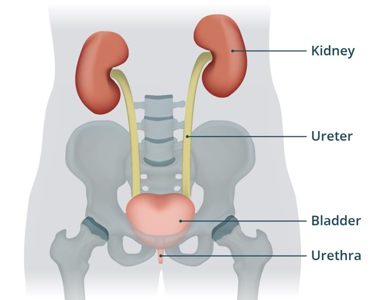
</p>

### Problem

| Challenge | Details |
|-----------|---------|
| ⚠️ Invasive testing burden | Bladder filling studies require catheterisation and cystometry |
| 🔁 Limited repeatability | Clinical trials cannot easily vary conditions |
| 📏 Impossible direct measurement | Wall stress and strain during 100→700 mL filling cannot be measured in vivo |

### Why This Matters

- ✅ **Non-invasive** evaluation method needed
- ✅ Repeatable simulation under diverse boundary conditions
- ✅ Accurate virtual environment grounded in real patient imaging data

---

## 🎯 Objectives

1. **Quantify** fluid distribution changes and wall deformation during 100–700 mL bladder filling
2. **Build** an FSI-based virtual model that faithfully reproduces real filling dynamics
3. **Establish** a foundation extendable to patient-specific digital twin simulation

---

## ⚙️ Workflow

### Full Pipeline

```
MRI Image
    │
    ▼ 3D Slicer (Segmentation)
3D Model (raw STL)
    │
    ▼ MeshLab (Smoothing)
3D Model (smoothed STL)
    │
    ▼ ANSYS SpaceClaim (Geometry)
 Add ureter inlets (Ø 3 mm) + urethra outlet (Ø 6 mm) + 3 mm wall
    │
    ▼ ANSYS Meshing
 Tetrahedron mesh | Body Sizing 1 mm | Refinement Level 3
    │
    ▼ Two-Way FSI via System Coupling
 ┌─────────────────────┐     ┌──────────────────────┐
 │ Transient Structural │◄───►│  Fluid Flow (Fluent)  │
 │  (Bladder Wall)      │     │  (Urine + Air VOF)    │
 └─────────────────────┘     └──────────────────────┘
```

---

### Step 1 — Segmentation (3D Slicer)

The bladder geometry was segmented from patient CT/MRI images using **3D Slicer 5.8.1**. The urinary bladder region was identified across axial, coronal, and sagittal slices and exported as an STL surface mesh.

<p align="center">
  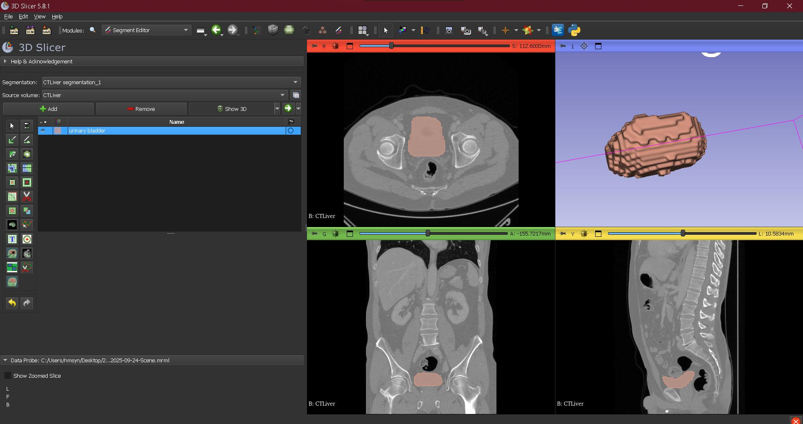
</p>

```
Tool:    3D Slicer v5.8.1
Module:  Segment Editor
Output:  Urinary Bladder STL (raw)
```

---

### Step 2 — Mesh Smoothing (MeshLab)

The raw segmentation mesh had surface noise and sharp artefacts. **MeshLab 2023.12** was used to apply iterative Laplacian smoothing, producing a biologically plausible, numerically stable geometry.

<p align="center">
  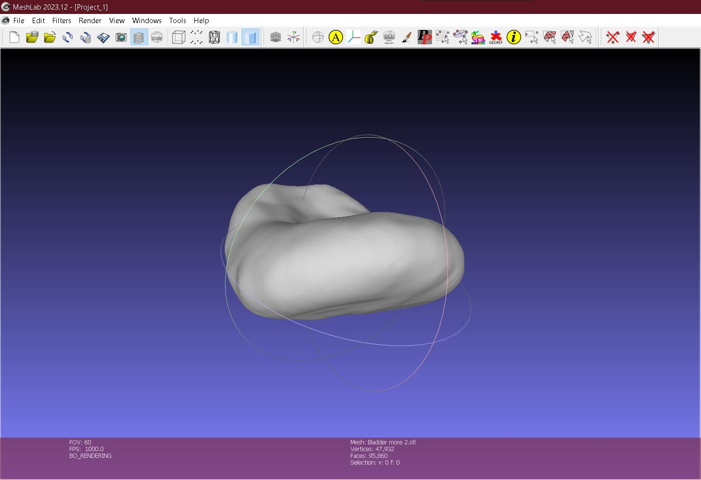
</p>

```
Tool:      MeshLab 2023.12
Vertices:  47,932
Faces:     95,860
```

---

### Step 3 — Geometry Setup (ANSYS SpaceClaim)

The smoothed STL was imported into **ANSYS SpaceClaim** to add anatomical inlets/outlets and shell the bladder wall.

<p align="center">
  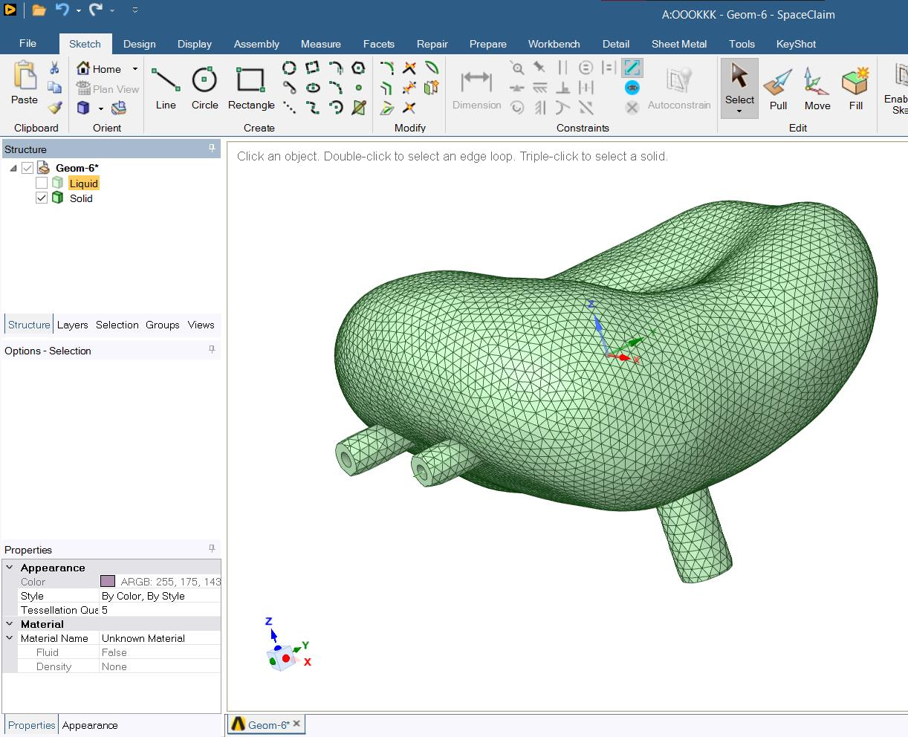
</p>

| Feature | Value | Reference |
|---------|-------|-----------|
| Ureter inlet diameter | 3 mm | [1] |
| Urethra outlet diameter | 6 mm | [2] |
| Bladder wall thickness | 3 mm | [3] |

---

### Step 4 — Meshing

<p align="center">
  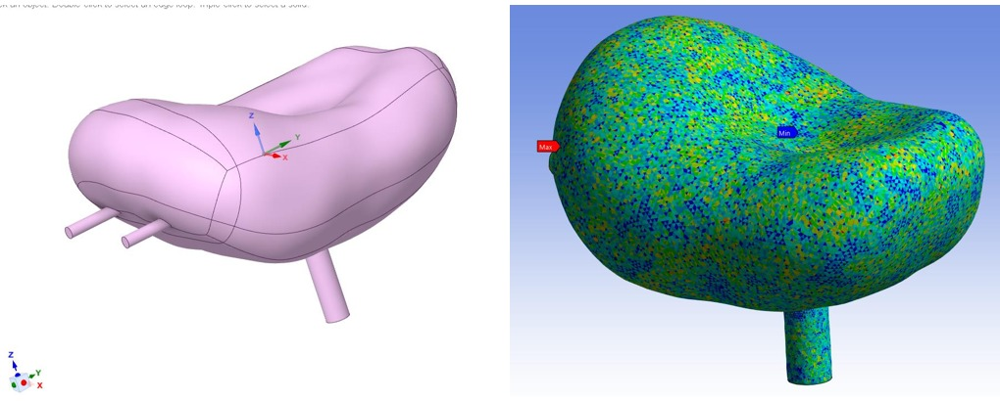
</p>

```
Method:        Tetrahedrons (Skewness-optimised)
Body Sizing:   1 mm
Resolution:    4
Refinement:    Level 3
```

---

### Step 5 — FSI Project Schematic (ANSYS Workbench)

<p align="center">
  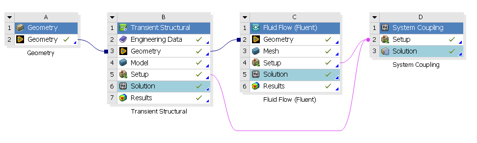
</p>

The project couples three solvers via **ANSYS System Coupling (D)**:
- **Block B** — Transient Structural → Bladder Wall
- **Block C** — Fluid Flow (Fluent) → Urine + Air
- **Block D** — System Coupling → bidirectional data exchange

---

## 🧪 Material Properties

### Bladder Wall — Hyperelastic Solid

Modelled as a **nearly incompressible hyperelastic material** using the **Mooney-Rivlin 2-parameter** constitutive model.

| Property | Value |
|----------|-------|
| Model | Mooney-Rivlin (2-parameter) |
| C10 (A) | 7,500 Pa |
| C01 (B) | 2,500 Pa |
| Density | 1,060 kg/m³ |
| Poisson's Ratio | 0.49 (nearly incompressible) |
| Bulk Modulus (K) | 3,000 kPa |
| Shear Modulus (μ = 2·C10) | 15,000 Pa |

### Urine — Newtonian Liquid

| Property | Value |
|----------|-------|
| Density | 1,030 kg/m³ |
| Dynamic Viscosity | 0.000797 Pa·s |

---

## 🖥️ Simulation Setup

### ANSYS Fluent — Fluid Domain

| Parameter | Setting |
|-----------|---------|
| Solver | Pressure-Based |
| Velocity Formulation | Absolute |
| Time | Transient |
| Gravity | 9.81 m/s² (−z) |
| Multiphase Model | Volume of Fluid (VOF) |
| VOF Formulation | Implicit |
| Surface Tension Coefficient | 0.0587 N/m |
| Phase 1 | Air |
| Phase 2 | Urine |
| Viscous Model | SST k-ω |

### Boundary Conditions

| Boundary | Condition |
|----------|-----------|
| Ureter Inlets (×2) | Velocity inlet: **0.284 m/s** |
| Urethra Outlet | **Wall (closed)** — filling simulation |

### Numerical Schemes (SIMPLE Method)

| Variable | Scheme |
|----------|--------|
| Gradient | Least Squares Cell Based |
| Pressure | PRESTO! |
| Momentum | Second Order Upwind |
| Volume Fraction | Compressive |
| Turbulent Kinetic Energy | Second Order Upwind |
| Specific Dissipation Rate | Second Order Upwind |
| Transient Formulation | First Order Implicit |

---

### Filling Time Calculation

Each ureter cross-sectional area:

$$A = \pi (0.0015)^2 = 7.07 \times 10^{-6} \text{ m}^2$$

Flow rate per ureter:

$$Q_1 = v \cdot A = 0.284 \times 7.07 \times 10^{-6} = 2.007 \times 10^{-6} \text{ m}^3/\text{s} \approx 2.007 \text{ mL/s}$$

Total flow (2 ureters):

$$Q_{tot} = 2 \times Q_1 = 4.013 \text{ mL/s}$$

Total filling time:

$$t = \frac{V}{Q_{tot}} = \frac{700}{4.013} \approx 174.5 \text{ s}$$

### Time-Step Configuration

| Parameter | Value |
|-----------|-------|
| Total simulation time | 174.5 s |
| Number of time steps | 1,745 |
| Time step size | 0.1 s |
| Max iterations / step | 5 |
| Reporting interval | 1 |
| Profile update | 1 |

---

## 📊 Results

### Volume Fraction — Urine Filling Progression

<p align="center">
  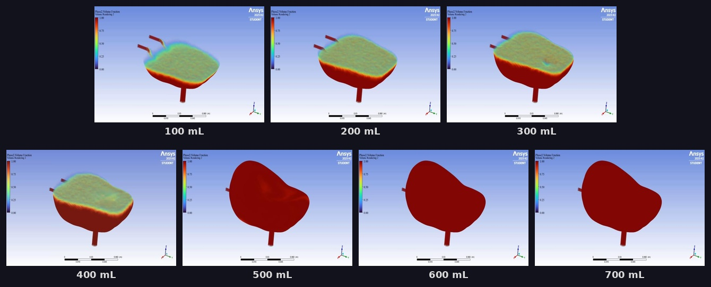
</p>

VOF contours show urine (Phase 2, value = 1.0, red) progressively displacing air (Phase 1, value = 0.0, blue) as filling advances.

| Stage | Volume | Observation |
|-------|--------|-------------|
| Early | 100–200 mL | Urine pools at inferior wall; air–urine interface visible |
| Mid | 300–400 mL | Interface rises; superior dome still partially air |
| Late | 500–600 mL | Near-complete urine occupation; residual air at dome |
| Full | 700 mL | Uniform urine distribution throughout |

---

### Total Deformation — Bladder Wall

<p align="center">
  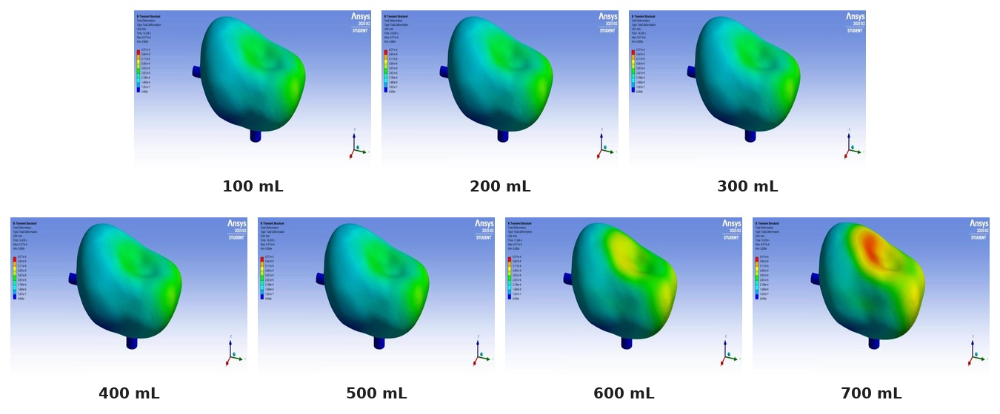
</p>

Structural deformation contours show the coupled mechanical response of the bladder wall to increasing intravesical pressure.

| Stage | Key Observations |
|-------|-----------------|
| 100–300 mL | Deformation concentrated at dome and lateral walls; uniform distribution |
| 400–500 mL | Increasing displacement at superior dome |
| 600–700 mL | Maximum deformation (red) localised at posterior-superior dome; stress concentrations near ureter junctions |

> **Key finding:** Maximum displacement regions align with anatomically known high-compliance zones of the bladder dome, consistent with clinical observations.

---

## ✅ Conclusion & Future Work

### Conclusions

- ✔️ Successfully reproduced fluid distribution and bladder wall deformation across 100–700 mL filling using two-way FSI
- ✔️ Identified deformation patterns and peak displacement locations under increasing fluid pressure
- ✔️ Demonstrated stable bidirectional fluid–structure coupling via ANSYS System Coupling

### Future Work

| Direction | Description |
|-----------|-------------|
| 🔍 **Model Validation** | Compare outputs against published literature and clinical cystometry data |
| 📐 **Sensitivity Analysis** | Evaluate influence of mesh resolution, time step size, and material constants |
| 🧬 **Model Enhancement** | Incorporate active muscle layers and viscoelastic material behaviour |
| 👤 **Digital Twin Extension** | Personalise model with individual patient imaging and urodynamic data |

---

## 🛠️ Tools & Software

| Tool | Version | Purpose |
|------|---------|---------|
| 3D Slicer | 5.8.1 | MRI/CT segmentation |
| MeshLab | 2023.12 | Surface smoothing |
| ANSYS SpaceClaim | 2025 R2 | Geometry preparation |
| ANSYS Meshing | 2025 R2 | Mesh generation |
| ANSYS Fluent | 2025 R2 | CFD — fluid domain |
| ANSYS Transient Structural | 2025 R2 | FEA — solid domain |
| ANSYS System Coupling | 2025 R2 | FSI coupling |

---

## 📚 References

[1] Lescay HA, Jiang J, Leslie SW, et al. *Anatomy, Abdomen and Pelvis Ureter.* StatPearls Publishing; 2025. https://www.ncbi.nlm.nih.gov/books/NBK532980/

[2] Su Y, Fang K, Mao C, et al. 640-slice DVCT multi-dimensionally and dynamically presents changes in bladder volume and urine flow rate. *Experimental and Therapeutic Medicine.* 2018;15:2557–2562. https://doi.org/10.3892/etm.2017.5671

[3] Hakenberg OW, Linne C, Manseck A, Wirth MP. Bladder wall thickness in normal adults and men with mild lower urinary tract symptoms. *Neurourology and Urodynamics.* 2000;19(5):585–593. https://doi.org/10.1002/1520-6777(2000)19:5<585::aid-nau5>3.0.co;2-u

[4] Barulina M, Timkina T, Ivanov Y, et al. Modeling the Stress–Strain State of a Filled Human Bladder. *Applied Sciences.* 2024;14(17):7562. https://doi.org/10.3390/app14177562

[5] Pradella M, Dorizzi RM, Rigolin F. Relative density of urine: methods and clinical significance. *Critical Reviews in Clinical Laboratory Sciences.* 1988;26(3):195–242. https://doi.org/10.3109/10408368809105890

[6] Chai X, van Herk M, van de Kamer JB, et al. Finite element based bladder modeling for image-guided radiotherapy of bladder cancer. *Medical Physics.* 2011;38(1):142–150. https://doi.org/10.1118/1.3523624

[7] Mills CO, Elias E, Martin GH, Woo MT, Winder AF. Surface tension properties of human urine. *Journal of Clinical Chemistry and Clinical Biochemistry.* 1988;26(4):187–194. https://doi.org/10.1515/cclm.1988.26.4.187

[8] Singla N, Singla A, Lee JS. A Novel, Non-Invasive Approach to Diagnosing Urinary Tract Obstruction Using CFD. *Journal of Young Investigators.* 2008. https://www.jyi.org/2008-may/2008/5/13/a-novel-non-invasive-approach-to-diagnosing-urinary-tract-obstruction-using-cfd

---

## 👤 Author

**Thar Htet Nyan**

---

<p align="center">
  <i>Built with ANSYS 2025 R2 · Grounded in real patient MRI data · Driven by the goal of non-invasive personalised medicine</i>
</p>
